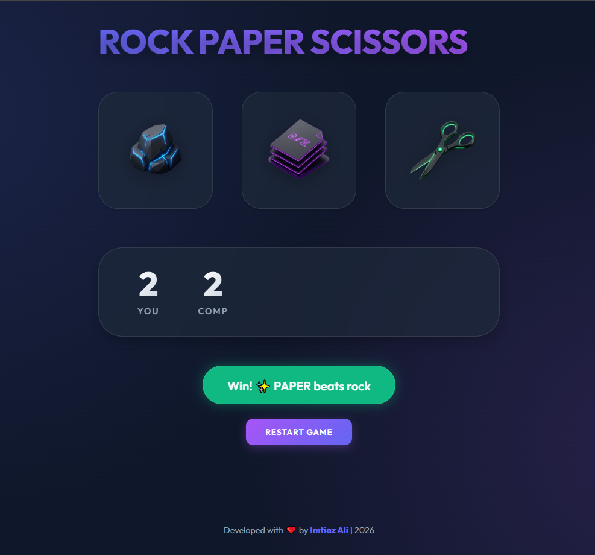

<div align="center">
  
# 💎 Rock Paper Scissors Premium

*A modern, high-performance web experience of the classic game, crafted with exceptional UI/UX standards, glassmorphic design, and smooth micro-interactions.*



</div>

---

## 🌟 Project Overview

**Rock Paper Scissors Premium** is a meticulously designed take on the beloved hand game. Elevating simple game mechanics to a professional-grade web application, this project focuses heavily on **aesthetics**, **visual feedback**, and **fluid animations** to provide a superior user experience.

### ✨ Key Features

- **Sleek Glassmorphism UI:** Built with dark-mode first principles, utilizing translucent blurred backgrounds (`backdrop-filter`), soft radial glow accents, and gradient typography styling.
- **Engaging Visual Feedback:** 
  - Dynamic tactile animations on elements using JS `transform` and CSS `cubic-bezier` timing functions.
  - Real-time notification banners that intelligently change color schemas based on the match outcome (Emerald for Win, Crimson for Loss, Amber for Draw).
- **Optimized Game Logic:** The JavaScript utilizes an efficient object-mapping technique (`winMap`) to cleanly and instantly evaluate round combinations instead of nested conditional statements.
- **Score Tracking & State Management:** Live tracking of both Player and Computer scores, alongside a hide/show conditional **Restart Game** module.
- **Fully Responsive Architecture:** Uses flexible CSS properties and Media Queries ensuring a pixel-perfect experience across desktops, tablets, and smartphones.

## 🛠️ Tech Stack & Architecture

- **Semantic HTML5:** Clean, accessible DOM structure ensuring SEO readiness (equipped with Open Graph meta tags).
- **CSS3 (Advanced):** Utilizes modern CSS variables (`:root`), flexbox alignments, customized Google Fonts ('Outfit'), text-gradients (`-webkit-background-clip`), and advanced drop-shadow logic.
- **Vanilla JavaScript (ES6+):** Pure, dependency-free JS containing DOM manipulations, randomized computer choices, functional state resets, and timeout-based animations.

## 📂 Internal Directory

```text
📦 Rock-Paper-Scissors-Game
 ┣ 📂 images/          # High-quality asset icons (rock.png, paper.png, scissors.png)
 ┣ 📜 index.html       # Main application layout and DOM tree
 ┣ 📜 style.css        # Premium stylesheets and responsive visual logic
 ┗ 📜 first.js         # Core application mechanics and event listeners
```

## 🚀 Play the Game locally

No builds, no transpilers required. Experiencing the premium UI is straightforward:

1. Clone or download this repository to your local machine.
2. Confirm the `images/` directory is kept beside the source files.
3. For the visual banner, place the screenshot as `project-screenshot.png` in the root folder.
4. Open `index.html` in any modern web browser to start playing.

---
<div align="center">
  <p>Developed with ❤️ by <b>Imtiaz Ali</b> | 2026</p>
</div>

